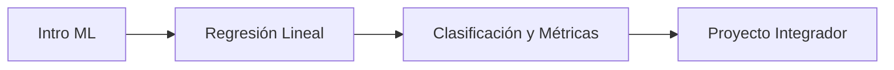

# Plan de Contenido: Clase 11 - Visualización Estadística con Seaborn y Análisis Exploratorio (EDA)

## 🛠️ Flujo de Trabajo General (Plantilla Checklist para Cada Clase)
Usa este checklist básico en **cada una de las 16 sesiones**:

### Antes de la Clase (Foco: Estilo de Vida y Expectativa)
- [ ] **Instagram Story:** Foto o video corto (15s) de tu setup de trabajo (computadora, café/mate, buena luz, apuntes). El foco es mostrar la estética de trabajar en tecnología y el estilo de vida flexible. Pregunta interactiva amplia (ej. *"¿Desde dónde se conectan hoy?"* o *"¿Team café o team mate para estudiar?"*).
- [ ] **TikTok:** Idea rápida de "Detrás de escena" o reto/advertencia humorística del día (ej. *"Hoy toca ver [Tema] y sé que a mis alumnos les va a doler la cabeza con esto"*).

### Durante la Clase (Foco: Comunidad y Gente Activa)
- [ ] **Instagram Story:** Graba un barrido rápido de la sala de Zoom llena de alumnos o del aula interactuando. Captura el momento en que se ríen o debaten. El mensaje debe ser: *"Comunidad activa aprendiendo juntos"*, demostrando que hay un grupo real de personas confiando en tu mentoría.
- [ ] **TikTok/Reels (Opcional):** Si usas trípode, graba tu reacción o explicación en vivo de un error muy común de código. Las caras de frustración seguidas de la resolución son muy virales.

### Después de la Clase (Foco: Inspiración y Resultados)
- [ ] **LinkedIn:** Comparte una lección aprendida como docente o un problema que surgió en clase y cómo lo resolvieron. Acompáñalo de un resumen técnico amigable.
- [ ] **TikTok (Educativo/Entretenido):** Graba un video corto (hasta 60s) explicando el concepto clave de la clase con una analogía de la vida real (ej. explicar un bucle con lavar los platos).

---

--- 

## 📅 Plan Específico para Redes Sociales

### 📌 Clase 11: Visualización Estadística con Seaborn y Análisis Exploratorio (EDA)
*   **Instagram (Stories):**
    *   [ ] Foto o captura de un mapa de calor (Heatmap) colorido: *"Parece arte abstracto, pero es un mapa de calor de correlaciones que nos dice qué variables están conectadas en un negocio. Así se toman las grandes decisiones corporativas."*
    *   [ ] Clips muy cortos de tus alumnos presentando los insights que descubrieron en sus primeros análisis visuales.
*   **LinkedIn:**
    *   [ ] Post compartiendo una plantilla metodológica de cómo hacer un Análisis Exploratorio de Datos (EDA) estructurado de principio a fin.
*   **TikTok:**
    *   [ ] Explicar qué es la correlación con un ejemplo gracioso (ej. a más consumo de café, mayor cantidad de código con bugs).

---

### Módulo 4: Estadística, Machine Learning y Proyecto Final

