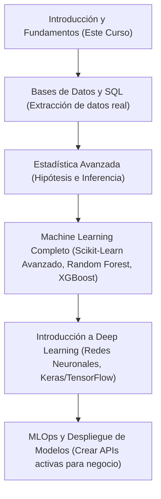

# Clase 16: Presentación de Proyectos, Conclusiones y Ruta Futura

**Duración sugerida:** 60 minutos  
**Modalidad:** presentación interactiva, debate y exposición teórica  
**Objetivo:** que el alumnado presente y reciba retroalimentación sobre sus resultados del Proyecto Final (el valuador predictivo), aprenda a documentar profesionalmente sus códigos en GitHub para armar un portafolio y tenga una ruta clara de los temas técnicos a estudiar a continuación.

---

### 🎨 Apoyo Visual para el Aprendizaje
* **Concepto:** Un paisaje isométrico en 3D que muestra un sendero de montaña. Un montañista está parado sobre el primer pico etiquetado como "Bases de Python y Pandas", contemplando un sendero que sube hacia cumbres más altas parcialmente cubiertas de nubes con las etiquetas "SQL", "Machine Learning Avanzado" y "MLOps".
* **Prompt para Generar Imagen con IA (Midjourney/DALL-E 3):**
  > *A 3D isometric landscape showing a mountain trail. A climber stands on the first peak labeled 'Python & Pandas Basics', looking at a path that winds up to higher peaks labeled 'SQL', 'Advanced Machine Learning', and 'MLOps'. Inspiring educational concept, clean vector style, bright sky background.*

---

## 1. Sesión de Retroalimentación del Proyecto Final (25 min)

### Explicación para instructor

Comienza la clase abriendo el espacio para que los alumnos comenten sus hallazgos del Proyecto Final inmobiliario:
- Pregúntales qué alcaldías resultaron tener la mayor variabilidad de precios.
- Indaga si notaron la fuerte correlación que existía entre los metros cuadrados y el precio, y si el valor del coeficiente de su modelo lineal hace sentido en la realidad mexicana (por ejemplo, si un coeficiente indica un aumento promedio de $1.3 millones de pesos por cada incremento significativo en tamaño).
- Fomenta el pensamiento crítico: ¿Por qué el modelo podría fallar en la vida real? *(Ejemplo: No tenemos datos del estado físico de la casa, si está remodelada, la cercanía al transporte público, el nivel de delincuencia de la zona, etc.)*.

---

## 2. Creación de un Portafolio Profesional en GitHub (15 min)

### Explicación para instructor

Explica al grupo que en el mundo del software y los datos, "demostrar que sabes hacer las cosas" vale más que un título en papel.
- **GitHub** es la plataforma estándar donde los desarrolladores y científicos de datos suben sus códigos.
- Un buen proyecto de portafolio debe tener un **README.md** sobresaliente que responda a:
  1. **Problema de Negocio:** ¿Qué problema querías resolver? (ej. automatizar valuaciones de casas para una PropTech).
  2. **Análisis Exploratorio:** ¿Qué descubriste de interesante al graficar? (mostrar las gráficas clave exportadas como imágenes).
  3. **Metodología y Modelo:** ¿Qué algoritmos de Scikit-Learn usaste y por qué?
  4. **Resultados Cuantitativos:** ¿Qué exactitud o error obtuviste en el conjunto de prueba ($R^2$, MSE)?
  5. **Conclusión y Recomendaciones:** ¿Cómo impacta tu modelo las finanzas o la operación del negocio?

Presenta la documentación limpia como el factor decisivo para que un reclutador o cliente se interese en contratarlos.

---

## 3. Ruta de Aprendizaje Recomendada para el Alumno (15 min)

### Explicación para instructor

Ayuda al grupo a asimilar que este curso de 16 clases fue una introducción de alto nivel y que el camino de la Ciencia de Datos es amplio y requiere práctica constante.
Delinea los siguientes temas a estudiar en el orden sugerido:

#### Recursos de estudio recomendados para el grupo:
- **Kaggle:** Plataforma ideal para descargar datasets reales de todo el mundo y participar en competencias de Machine Learning.
- **Libros clave:** *"Introduction to Statistical Learning"* (ISLR), la biblia introductoria del modelado matemático.

---

## 4. Cierre del Curso (5 min)

### Explicación para instructor

Cierra la sesión con un mensaje motivador y agradece al grupo por su dedicación a lo largo de estas 16 clases.
Recuérdales que la habilidad más importante de un Científico de Datos no es saber de memoria las líneas de código (eso se puede consultar en la documentación o usando herramientas interactivas), sino la **curiosidad por explorar**, el **pensamiento analítico** y la **capacidad de hacer preguntas inteligentes a los datos** para resolver problemas reales del mundo.

¡Felicidades a todos los graduados del curso!
